# Vectorless-RAG — Legal Statutory & SOP Conversational Assistant

Vectorless-RAG is a highly precise statutory and Standard Operating Procedures (SOP) query resolver. Unlike traditional RAG systems that split documents into arbitrary text chunks and rely on approximate vector embeddings (which often lose structural hierarchy, context, and cross-references), Vectorless-RAG indexes legal texts into their native hierarchical trees (Acts → Chapters → Sections) and applies guided traversal logic alongside keyword indexing (BM25) to retrieve exact statutory content with 100% groundedness.

The system features two alternative operational pipelines implemented using **LangGraph**:
1. **Deterministic State Machine Flow**: A strict, structured flow utilizing query rewriting, keyword heuristic routing, hierarchical search, cross-reference linking, and answer generation verified by an LLM-based groundedness check.
2. **True ReAct Agent Loop**: An autonomous agent utilizing LangGraph's prebuilt reasoning loop to dynamically select legal search tools, resolve cross-references, expand queries, and synthesize a cited legal opinion.

---

## System Architecture

```mermaid
flowchart TD
    subgraph Ingestion Pipeline [1. Ingestion & Tree Indexing]
        PDFs[BNS / BNSS / BSA PDFs] -->|parser.py| Parquet[Parquet Datasets]
        SOP[Police SOP PDF] -->|sop_parser.py| SOPParquet[SOP Parquet]
        Parquet -->|tree_builder.py| TreeIndex[Hierarchical Index tree/]
        SOPParquet -->|tree_builder.py| TreeIndex
    end

    subgraph Deterministic [Option A: Deterministic Flow]
        QueryA[User Query] --> ContextRouter{Context Router}
        ContextRouter -->|Cache Hit| GenA[Generator Node]
        ContextRouter -->|Cache Miss| HeuristicRouter[Intent Classifier]
        HeuristicRouter --> Search[BM25 + Tree Nav + SOP Search]
        Search --> Linker[Cross-Reference Linker]
        Linker --> Assembler[Context Assembler]
        Assembler --> GenA
        GenA --> Verifier{Groundedness Verifier}
        Verifier -->|Passed| FinalA[Answer Output]
        Verifier -->|Failed| Search
    end

    subgraph ReAct [Option B: ReAct Agent Loop]
        QueryB[User Query] --> Agent[ReAct Agent Loop]
        Agent -->|Thought| ToolSelection{Tool Selection}
        ToolSelection -->|Call| Tool1[search_statutes]
        ToolSelection -->|Call| Tool2[search_police_sop]
        ToolSelection -->|Call| Tool3[enrich_with_cross_references]
        Tool1 -->|Observation| Agent
        Tool2 -->|Observation| Agent
        Tool3 -->|Observation| Agent
        Agent -->|Format Response| FinalB[Answer Output]
    end
```



---

## Directory Structure

```
Vectorless-RAG/
├── source_documents/           # Original PDF documents (BNS, BNSS, BSA, Police SOP)
├── tree/                       # Hierarchical JSON tree index and BM25 index
├── src/                        # Codebase source files
│   ├── parser.py               # Main layout-aware PDF parser for Acts (BNS, BNSS, BSA)
│   ├── sop_parser.py           # Coordinate-based and layout-aware parser for Police SOPs
│   ├── validation.py           # Ingestion validation suite (checks contiguity, orphans, counts)
│   ├── main.py                 # Ingestion coordinator (PDF -> Parquet)
│   ├── tree_builder.py         # Constructs the hierarchical act/SOP trees
│   ├── build_tree.py           # Builds the JSON tree files and initializes summaries
│   ├── cli.py                  # CLI interface for the Deterministic state-machine flow
│   │
│   ├── retriever/              # In-memory retrieval engine
│   │   ├── __init__.py         # Loader and query interface
│   │   ├── client.py           # Gemini/LangChain model client wrappers
│   │   ├── corpus_index.py     # In-memory JSON tree lookup
│   │   ├── bm25_index.py       # BM25 keyword search index (wrapped via bm25s)
│   │   ├── tree_navigator.py   # Guided hierarchical LLM tree search
│   │   ├── sop_retriever.py    # Structured LLM-guided SOP retrieval
│   │   └── cross_ref_linker.py # Resolves Act-to-Act & Act-to-SOP cross-references
│   │
│   ├── generator/              # Deterministic State Machine generator graph
│   │   ├── __init__.py         # Generation interface
│   │   ├── graph.py            # LangGraph state machine definition
│   │   ├── state.py            # Graph state TypeDicts
│   │   └── generator_agent.py  # Generation and groundedness verification agents
│   │
│   └── react_agent/            # ReAct Agent implementation
│       ├── __init__.py         # ReAct generate interface
│       ├── agent.py            # prebuilt create_react_agent definition
│       ├── tools.py            # Search tools wrapped for LLM calling
│       ├── cli_react.py        # CLI interface with live reasoning traces
│       └── benchmark.py        # Comparative benchmark script (Deterministic vs. ReAct)
│
├── requirements.txt            # Python package dependencies
└── README.md                   # Project documentation
```

---

## Setup & Installation

### Prerequisites
- Python 3.10+
- Access to Google Gemini API (recommend `models/gemini-3.1-flash-lite` or `models/gemini-3.1-pro`)

### 1. Environment Configuration
Create a virtual environment and install all necessary dependencies:
```powershell
python -m venv .venv
.venv\Scripts\Activate.ps1
pip install -r requirements.txt
```

Set your Google API Key:
```powershell
# Windows PowerShell
$env:GEMINI_API_KEY="your-google-api-key-here"

# Windows CMD
set GEMINI_API_KEY=your-google-api-key-here
```

### 2. Ingest and Parse PDFs
Place `BNS.pdf`, `BNSS.pdf`, `BSA.pdf`, and `SOP.pdf` in the `source_documents/` folder.
Run the layout parser to generate the Parquet datasets:
```powershell
$env:PYTHONPATH="."
python src/main.py
```
This runs `validation.py` to guarantee that structural counts (e.g. 358 BNS sections, 531 BNSS sections, 170 BSA sections, and 445 First Schedule table offence rows) are fully parsed and contiguous.

### 3. Build the Tree Index
Transform the parsed Parquet datasets into the hierarchical JSON tree index and generate summaries:
```powershell
python src/build_tree.py
```
This generates the tree files under the `tree/` directory along with the pre-tokenized `bm25_index/`.

---

## How to Run

### Option A: Deterministic Assistant
To run the query assistant driven by the deterministic LangGraph state machine:
```powershell
python src/cli.py
```
**Features**:
- Heuristic-based intent routing.
- Context caching (reuses context for follow-up clarifications without calling retrieval tools).
- Explicit groundedness verification check (strictly prevents hallucinations).

### Option B: Autonomous ReAct Assistant
To run the assistant driven by the autonomous ReAct agent loop:
```powershell
python src/react_agent/cli_react.py
```
**Features**:
- Streaming reasoning trace showing **Thought → Action → Observation** live in the console.
- Dynamic tool utilization (decides what, when, and how many times to search based on context).
- Multi-turn robust memory parsing.

### Run Comparative Benchmarks
To compare latency, LLM call efficiency, and citation depth between both backends:
```powershell
python src/react_agent/benchmark.py
```

---

## Core Components Detail

### 1. Layout-Aware Parsing (`src/parser.py`, `src/sop_parser.py`)
- Reads PDFs using coordinates to distinguish headers, footers, body text, and tables.
- Separates acts into structural nodes (Chapters, Sections, Subsections) and isolates schedules.
- Dynamically parses the complex multi-page classification tables (First Schedule of BNSS) into tabular rows containing columns for offence, punishment, cognizable status, bailable status, and court triable.

### 2. Hierarchical Tree Index (`src/tree_builder.py`)
- Standardizes parsed outputs into JSON nodes carrying parent-child relations.
- Dynamically generates LLM summaries for top-level nodes (Chapters) to help guided retrieval selectors.

### 3. Hierarchical Guided Nav (`src/retriever/tree_navigator.py`)
- Resolves queries through a top-down hierarchy:
  1. An LLM selects the candidate Chapters matching the query using Chapter summaries.
  2. For selected Chapters, another LLM call selects candidate Sections by evaluating section titles.
  3. Returns the full contents of the chosen sections.

### 4. Cross-Reference Resolution (`src/retriever/cross_ref_linker.py`)
- Parses cross-references (e.g., "Section 173 of BNSS" cited in SOP, or internal references like "Section 45" inside BSA).
- Automatically resolves target node content to build unified context across different legal acts.
