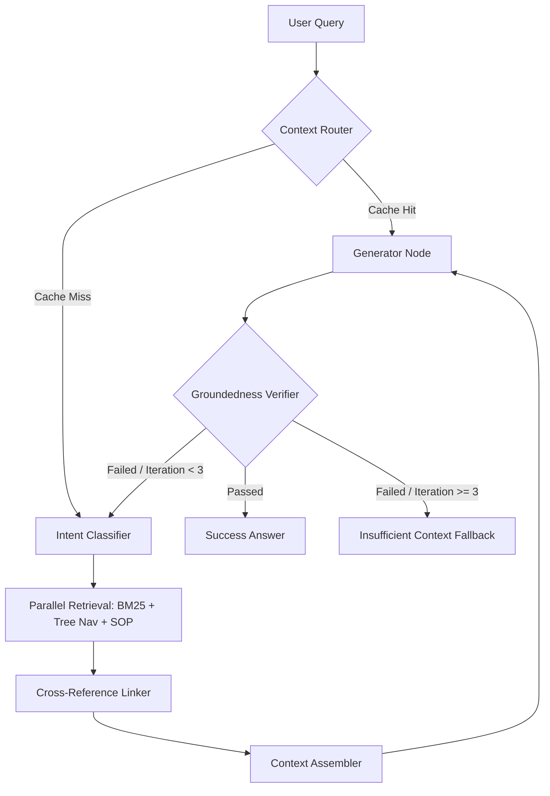

# Component Implementation: Deterministic Graph Pipeline

The deterministic workflow enforces strict execution steps to resolve queries. It is implemented using LangGraph in `src/generator/graph.py`.

---

## 1. Graph State Definition (`src/generator/state.py`)

The state is managed using the `AgentState` TypedDict:
```python
class AgentState(TypedDict):
    query: str                       # User's query
    target_corpora: List[str]        # Determined target acts (BNS, BNSS, BSA, SOP)
    query_type: str                  # Statute vs. SOP vs. Both
    bm25_hits: List[RetrievedNode]   # Intermediate keyword search hits
    tree_hits: List[RetrievedNode]   # Intermediate tree navigation search hits
    cross_ref_hits: List[RetrievedNode] # Linked references
    final_results: List[RetrievedNode]  # Unified context passed to generator
    final_answer: str                # Formatted markdown output
    citations: List[dict]            # Resolved references
    verification: dict               # Groundedness verifier scores/feedback
    error: Optional[str]             # Execution logs
    iteration_count: int             # Verification loop count
```

---

## 2. Graph Nodes & Edge Decision Workflow



### Node 1: Context Router
- Evaluates if the current multi-turn query can be resolved using context already retrieved in the previous turn (e.g. "Can you repeat the rule?").
- **Edge Routing**: If `True`, routes directly to `Generator` (skipping retrieval). If `False`, routes to `IntentClassifier`.

### Node 2: Intent Classifier
- Uses keyword heuristics to detect target acts (e.g. "FIR" maps to `SOP` and `BNSS`, "murder" maps to `BNS`).
- Outputs `target_corpora` to focus downstream retrievers.

### Node 3: Parallel Search
- Triggers both `BM25` searches and LLM-guided `TreeNavigator` (or `SOPRetriever`) in parallel.

### Node 4: Cross-Reference Linker
- Scans all hits for citations and pulls in the related sections.

### Node 5: Context Assembler
- Deduplicates all retrieved nodes, compiles citations, and formats them into a clean XML block.

### Node 6: Generator Agent
- Generates the cited answer matching the requested markdown layout.

### Node 7: Groundedness Verifier Agent
- Evaluates the final answer against the retrieved context:
  - Verifies that every assertion is strictly grounded (100% supported by the text).
  - Scores the response between `0.0` and `1.0`.
  - **Loopback Condition**: If score is `< 0.90` and `iteration_count < 3`, it rewrites the search query and loops back to retrieval. If verification continues to fail, it outputs an `Insufficient Context` warning.
