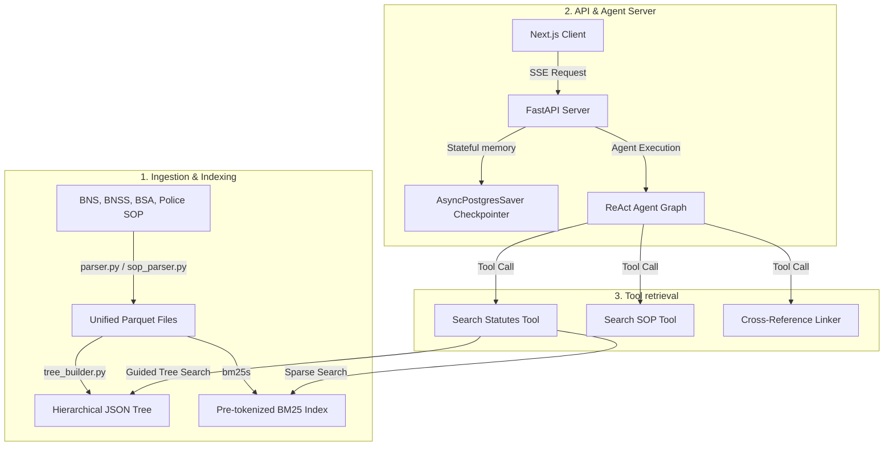

# Technical Implementation Report: Vectorless-RAG Backend

This report details the system architecture, design decisions, ingestion pipeline, retrieval strategies, and comparative benchmarks of the **Vectorless-RAG Backend**.

---

## 1. System Overview & Core Methodology

Standard vector-database RAG pipelines perform poorly when applied to structured statutory law. Splitting a legal code (like the BNS or BNSS) into arbitrary overlap chunks disrupts the hierarchical relationships between chapters, sections, and subsections, causing three major retrieval failures:
1. **Context Blindness**: Loss of scope (e.g., retrieving a section on "penalties" without the context of the chapter's applicability rules).
2. **Cross-Reference Blindness**: Inability to resolve explicit internal citations (e.g., *"subject to the provisions of section 35"*).
3. **Keyword Inexactness**: Missing precise statutory numbers or terms due to vector semantic abstraction.

**Vectorless-RAG** solves this by indexing the corpus into its native hierarchical tree structure (Act $\rightarrow$ Chapter $\rightarrow$ Section) and using guided traversal routers alongside key-token matching (BM25) and citation-graph resolution.



---

## 2. Ingestion & Parsing Engine

The ingestion pipeline (implemented in `src/parser.py` and `src/sop_parser.py`) converts raw PDFs into clean, structured records.

### 2.1 Coordinate-based Layout Extraction
Rather than extracting raw text streams, the parser reads page-by-page layout dictionaries via **PyMuPDF**:
- **Headers & Footers Purging**: Filters lines falling outside vertical thresholds ($y < 50$ or $y > 750$).
- **Multi-Line Section Heading Resolution**: Reconstructs broken titles by checking if a bold/semantically unique header spans multiple lines.
- **Sequential Validation**: A contiguity validator (`src/validation.py`) enforces that section IDs increase monotonically, preventing gaps and identifying orphans.
- **First Schedule Parsing**: Processes the multi-page borderless offence classification tables in the BNSS using horizontal coordinate boundaries to align column values (offence description, bailable status, cognizable status, court triable).

---

## 3. Index & Graph Construction

### 3.1 The Tree Index
The parsed data is structured into nested JSON trees under `tree/` (including `BNS.json`, `BNSS.json`, `BSA.json`, `SOP.json` and the main consolidated `index.json`).
1. **Leaf Nodes (Sections)**: Contain the raw statutory text, section numbers, act codes, and metadata.
2. **Intermediate Nodes (Chapters)**: Contain names, section spans, and **LLM-generated chapter summaries** (generated bottom-up using Google Gemini models).
3. **Root Nodes (Acts)**: Synthetic entry points representing the entire act (BNS, BNSS, BSA).

### 3.2 BM25 Indexing
For sparse keyword search, the text of all sections is pre-tokenized and stored in a lexical index (`tree/bm25_index/`) using **BM25s**, enabling near-instantaneous lexical retrieval.

---

## 4. LangGraph Retrieval Pipelines

The backend implements two alternative query resolution strategies using **LangGraph** powered by **Google Gemini** models (specifically `models/gemini-3.1-flash-lite` in production for optimal latency):

### Option A: Deterministic State Machine Flow
A rigid, pre-defined workflow designed for high consistency and strict verification:
1. **Context Router**: Evaluates if the query is a follow-up that can be answered using active context cache.
2. **Intent Classifier**: Maps queries to target acts (e.g., routing arrest procedures to BNSS, evidence to BSA).
3. **Retrieval**: Combines Guided Tree Traversal and BM25 search to fetch candidate sections.
4. **Cross-Reference Linker**: Parses mentions of other sections (internal and cross-act) and retrieves them to complete the context.
5. **Groundedness Verifier**: Compares the generated answer against retrieved text. If any claims fail validation, it routes back to search with refined parameters.

### Option B: Autonomous ReAct Agent Loop
A dynamic, prebuilt LangGraph agent loop powered by `create_react_agent` compiled with structured output constraints. The agent is equipped with three tools:
1. **`search_statutes`**: Combines tree-navigation and BM25 to locate relevant sections in BNS, BNSS, or BSA.
2. **`search_police_sop`**: Queries the structured police operations manual.
3. **`enrich_with_cross_references`**: Traverses citation paths to resolve links between acts and guidelines.

---

## 5. Structured Response Schema

The ReAct agent is bound to a strict Pydantic output schema (`GeneratedAnswer` in `src/retriever/schemas.py`) to guarantee consistent, structured payloads:

```python
class GeneratedAnswer(BaseModel):
    answer_text: str  # Markdown response with standard bracketed inline citations (e.g., [Source: ID])
    key_provisions: List[str]  # Bulleted summary points citing their sources
    citations: List[str]  # Exact node IDs referenced in the response (e.g., ['BNS_S64'])
    is_insufficient_context: bool  # True if RAG search is insufficient to generate an answer
    chat_title: Optional[str]  # Concise 3-4 word title generated on the first turn of a chat session
    suggested_follow_up_questions: List[str]  # 3-4 relevant follow-up questions
    action_items: List[str]  # Checklist of legal/procedural actions for the user (e.g., 'File an FIR')
```

---

## 6. API, DB Checkpointer & Deployment

- **FastAPI SSE Streaming**: Streams agent logs (Thoughts, Tool Calls, Observations) and the final structured answer to the client in real-time.
- **Persistent Postgres Memory**: Uses **`AsyncPostgresSaver`** via a connection pool (`AsyncConnectionPool` with 10 slots) to persist agent checkpoint states directly into a Supabase PostgreSQL database.
- **Custom Sessions Metadata**: Manages user-facing session history by maintaining and querying a custom `chat_sessions` table in the database:
  ```sql
  CREATE TABLE chat_sessions (
      thread_id TEXT PRIMARY KEY,
      user_id TEXT NOT NULL,
      title TEXT NOT NULL,
      updated_at TIMESTAMPTZ DEFAULT CURRENT_TIMESTAMP
  );
  CREATE INDEX idx_chat_sessions_user_id_updated_at ON chat_sessions (user_id, updated_at DESC);
  ```
- **Supabase JWT Authorization**: Secures backend API routes by extracting, decoding, and verifying Supabase JWT authorization tokens on all inbound requests.
- **Python Deployment Script**: Deploys the application code directly to Hugging Face Spaces using the `huggingface_hub` SDK via [deploy.py](file:///c:/Met4l.DSCode/Projects/Vectorless-RAG/deploy.py) (ignoring local virtual environments and database files via `.huggingfaceignore`).

---

## 7. Comparative Evaluation Metrics

Below is a benchmark summary comparing the two pipeline options:

| Metric / Dimension | Deterministic Pipeline | ReAct Agent Pipeline |
| :--- | :--- | :--- |
| **Model Platform** | Google Gemini | Google Gemini (`models/gemini-3.1-flash-lite`) |
| **Simple Queries** | Fast, high consistency, moderate latency. | Slightly higher initial latency due to tool choice step. |
| **Complex/Multi-Act Queries** | May fail to retrieve cross-act provisions if heuristic routing misclassifies primary intent. | Excellent. Dynamically runs multiple searches to merge BNS, BNSS, and SOP context. |
| **Average Latency** | 4-8 seconds. | 8-15 seconds (varies based on reasoning steps). |
| **LLM Call Overhead** | Fixed (approx. 4 calls per query). | Variable (1-3 reasoning steps + tool loops). |
| **Groundedness** | High (enforced by separate LLM verifier). | High (inherent to tool observation constraints). |
