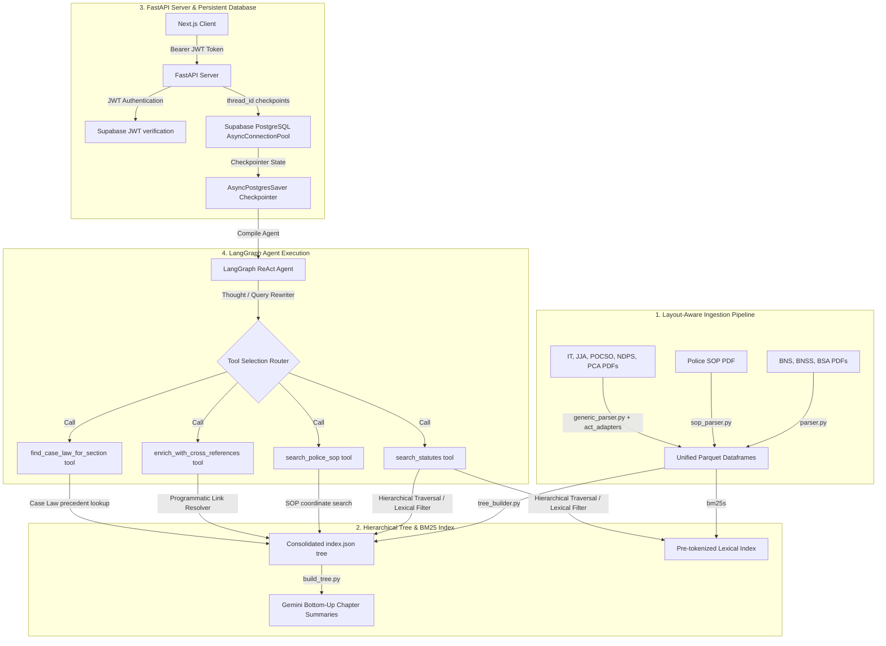

# Technical Implementation Report: Vectorless-RAG Backend

This report provides a detailed overview of the architectural design, algorithmic workflows, database schemas, and API integration for the **Vectorless-RAG Backend**.

---

## 1. Architectural Blueprint & Core Design Paradigm

Standard RAG architectures split documents into flat text blocks based on fixed character counts or token boundaries (overlapping chunks). This approach fails when applied to legal codes and procedural manuals due to three primary structural limitations:

1. **Context Blindness**: Loss of hierarchical scoping. For instance, retrieving a subsection detailing "bail conditions" without retrieving the overarching Chapter context containing geographic applicability or general exceptions.
2. **Cross-Reference Blindness**: Legal texts are heavily cited graphs. A section in the *Police Standard Operating Procedures (SOP)* manual might state, *"conduct an arrest in accordance with Section 35 of BNSS."* Standard chunking is blind to these references.
3. **Lexical Retrieval Gaps**: Approximate nearest-neighbor searches (vector search) abstract away exact section numbers or statutory keyword identifiers, leading to imprecise context assembly.

**Vectorless-RAG** addresses these challenges by replacing semantic vector spaces with **Hierarchical native trees** (Act $\rightarrow$ Chapter $\rightarrow$ Section) coupled with Guided Traversal LLM Routers, a pre-tokenized sparse lexical search engine (BM25s), and a programmatic cross-reference resolving graph.



---

## 2. Layout-Aware Parsing & Ingestion

The ingestion pipeline (implemented in `src/parser.py`, `src/sop_parser.py`, and `src/generic_parser.py`) processes raw legal PDFs and constructs structured dataframes.

### 2.1 Configurable Generic Parsing (Phase 9 Expansion)
To parse 5 new statutory Acts (IT Act 2000, JJ Act 2015, POCSO 2012, NDPS Act 1985, and Prevention of Corruption Act 1988) without duplicate code, the system introduces a **Generic Act Parser** driven by per-act layout adapter configurations (`src/act_adapters/__init__.py`):
- **Arabic and Roman Chapter Numbers**: The IT Act utilizes Arabic numerals (`CHAPTER 1`) in its body but Roman numerals in its TOC. An extended chapter regex `CHAPTER\s+([IVXLCDM\d]+[A-Z]?)$` is configured to correctly group both formats.
- **Hyphenated Section Numbers**: The NDPS Act utilizes hyphenated numbering for sub-chapters (e.g. `68-I.`, `68-O.`). The section regex is extended to `^(\d{1,3}(?:[A-Z]|-[A-Z])?)` to capture hyphenated sections as leaf nodes rather than treating them as standard paragraphs.
- **Dynamic Preamble Offsets**: Each act configuration defines its own `body_start_page` (0-indexed) to skip front-matter Arrangement of Sections tables and prevent duplicate matches during physical line coordinate grouping.

### 2.2 Coordinate-based Layout Pruning
Unlike linear PDF readers, PyMuPDF parses page dictionaries to extract text lines alongside font flags and bounding coordinates:
- **Header & Footer Stripping**: Lines with vertical coordinates $y < 50$ or $y > 750$ are stripped dynamically, preventing page numbers and running headers from polluting the text.
- **Section Heading Lookahead**: Section numbers (e.g., *"35."*) often sit on their own line. The parser performs lookahead checks on succeeding lines to reconstruct complete headings and avoid orphaned headings.
- **Sequential Validation (`src/validation.py`)**: A contiguity validator asserts that section IDs increase monotonically ($S_1 \rightarrow S_2 \rightarrow S_3$) to ensure no sections were dropped or malformed.

### 2.3 Heuristic Repairs & Typos
- **Chapter V Injection in BNSS**: The source BNSS PDF contains a structural error where Chapter V ("ARREST OF PERSONS") at Section 35 was omitted from the Table of Contents. The parser uses a regular expression heuristic to inject the parent Chapter V node at Section 35, establishing proper hierarchical linking.
- **Act Root Nodes**: The parser injects a Level 0 root node (e.g., `BNS_root`, `IT_root`) for each Act. Front Matter and Chapters are linked directly to their respective root node (`parent_id = f"{act}_root"`).

### 2.4 Table Parsing (First Schedule of BNSS)
The classification table in the First Schedule of BNSS contains detailed columns (offence, bailable, cognizable, triable court). The parser isolates coordinates for columns and cells, merges borderless rows that wrap across multiple pages, and injects `act_code = "BNSS"` to avoid schema ambiguity when combined.

---

## 3. Tree Construction & Lexical Indexing

### 3.1 Hierarchical Bottom-Up Summarization
The parsed sections are compiled into JSON trees (`tree/*.json` and `tree/index.json`).
1. **Leaf Nodes (Level 2/3 - Sections)**: Contain the raw statutory text.
2. **Intermediate Nodes (Level 1 - Chapters)**: Generated by performing **bottom-up roll-up summarization**. Leaf nodes are grouped, and the Google Gemma API (alternating between `models/gemma-4-26b-a4b-it` and `models/gemma-4-31b-it` in a rate-limited, round-robin pool) is invoked asynchronously to generate a concise summary of the Chapter's scope.
3. **Root Nodes (Level 0 - Acts)**: Synthesize summaries of all children chapters to create a global entry-point overview.

### 3.2 BM25 Indexing
A lexical index (`tree/bm25_index/`) is pre-computed using the **BM25s** library. All statutory section texts are tokenized, stemmed, and indexed. Lexical search supports act-specific filters (`act_filter`) to limit lexical candidate retrieval.

---

## 4. LangGraph Retrieval Pipelines

The backend implements two alternative query resolution pipelines:

### 4.1 Deterministic State Machine Flow
Built using a custom LangGraph state machine, this workflow enforces a structured sequence of operations:
- **`route_context`**: Evaluates if the query is a follow-up that can be answered using active context cache.
- **`classify_intent`**: Determines target acts (e.g., routing bail queries to BNSS, evidence to BSA).
- **`retrieve_nodes`**: Runs Guided Tree Traversal (LLM selects chapters, then sections) and merges results with BM25 keyword outputs.
- **`enrich_cross_references`**: Traverses citation paths to resolve links between acts and guidelines.
- **`verify_groundedness`**: A dedicated LLM verification node compares claims against retrieved context, returning a boolean check. Fails result in a retrieval refinement loop.

### 4.2 Autonomous ReAct Agent Loop
A dynamic agent loop compiled using `create_react_agent` and bound to a Pydantic structured output model. The agent has access to four search tools:

#### 1. `search_statutes(statute_code, query, method)`
- **Parameters**: `statute_code` (BNS, BNSS, BSA, IT, JJA, POCSO, NDPS, or PCA), `query` (search text), `method` (hybrid, tree, or bm25).
- **Behavior**: Retrieves statutory sections using guided chapter/section selection and BM25 token matching.

#### 2. `search_police_sop(query)`
- **Parameters**: `query` (search text).
- **Behavior**: Queries the structured police operations manual.

#### 3. `enrich_with_cross_references(section_id)`
- **Parameters**: `section_id` (e.g., `'BNSS_S35'`, `'IT_S66'`).
- **Behavior**: Programmatically crawls the index for cross-referenced sections linked to the target section, returning their raw contents.

#### 4. `find_case_law_for_section(section_id)`
- **Parameters**: `section_id` (e.g., `'NDPS_S37'`).
- **Behavior**: [Phase 10 Scaffold] Looks up associated judicial precedents in the `interpreted_by` node metadata to prepare for the case law precedents corpus integration.

---

## 5. Structured Response Schema

The ReAct agent is bound to a strict Pydantic output schema (`GeneratedAnswer` in `src/retriever/schemas.py`) to guarantee consistent, structured payloads:

```python
class GeneratedAnswer(BaseModel):
    answer_text: str  # Detailed response text formatted with Markdown and standard bracketed citations
    key_provisions: List[str]  # Bulleted summary points citing their sources
    citations: List[str]  # Exact node IDs referenced in the response (e.g., ['BNS_S64'])
    is_insufficient_context: bool  # True if RAG search is insufficient to generate an answer
    chat_title: Optional[str]  # Concise 3-4 word title generated on the first turn of a chat session
    suggested_follow_up_questions: List[str]  # 3-4 relevant follow-up questions
    action_items: List[str]  # Checklist of legal/procedural actions for the user (e.g., 'File an FIR')
```

---

## 6. API, Persistent Database & Deployment

### 6.1 Server-Sent Events (SSE) Streaming
The `POST /api/chats/{thread_id}/message` route executes `agent.astream(..., stream_mode="updates")` and yields live logs as JSON-wrapped SSE events:
- **`thought`**: Streams raw text of the agent's thought process.
- **`tool_call`**: Details the tool name and arguments invoked.
- **`observation`**: Outputs a truncated preview of retrieved context.
- **`title_generated`**: Yields the dynamic chat title on the first turn.
- **`final_answer`**: Sends the fully compiled structured response object.

### 6.2 Supabase PostgreSQL Checkpointer
Rather than using local file checkpointers, the FastAPI app instantiates `AsyncPostgresSaver` over an `AsyncConnectionPool` connecting directly to a Supabase Postgres instance:
- **Checkpoint Tables**: LangGraph manages schema state using three tables (`checkpoints`, `writes`, and `checkpoint_blobs`) automatically migrated on startup.
- **`chat_sessions` Metadata Table**: Exposes chat session history listing user-specific chat titles:
  ```sql
  CREATE TABLE chat_sessions (
      thread_id TEXT PRIMARY KEY,
      user_id TEXT NOT NULL,
      title TEXT NOT NULL,
      updated_at TIMESTAMPTZ DEFAULT CURRENT_TIMESTAMP
  );
  CREATE INDEX idx_chat_sessions_user_id_updated_at ON chat_sessions (user_id, updated_at DESC);
  ```

### 6.3 JWT Security Gateway
Authentication is validated on all request headers (`Authorization: Bearer <JWT>`) using JSON Web Key Sets (JWKS) fetched and cached from the Supabase Auth server:
```python
# Fetches public keys from Supabase auth endpoint to verify RS256/ES256 signatures
jwks = await fetch_jwks()
payload = jwt.decode(token, public_key, algorithms=["RS256", "ES256"], audience="authenticated")
```

### 6.4 Non-Git Deployment Architecture
To bypass Windows command-line globbing limits and avoid git binary rejections, the backend implements [deploy.py](file:///c:/Met4l.DSCode/Projects/Vectorless-RAG/deploy.py) which pushes files via the `huggingface_hub` SDK. This programmatically filters out ignored paths specified in `.huggingfaceignore`.

---

## 7. Pipeline Performance Evaluation

Below is a benchmark summary comparing the deterministic pipeline and ReAct agent on a selection of original BNS/BNSS/BSA queries and the new Phase 9 corpora (IT, JJA, POCSO, NDPS, PCA):

| Metric / Dimension | Deterministic Pipeline | ReAct Agent Pipeline |
| :--- | :--- | :--- |
| **Model Platform** | Round-Robin Model Pool (`models/gemini-3.1-flash-lite`, `models/gemma-4-26b-a4b-it`, `models/gemma-4-31b-it` in `client.py`) | Google Gemini (`models/gemini-3.1-flash-lite` in `agent.py`) |
| **Simple Queries** | Fast, high consistency, low latency (~200ms - 500ms). | Moderate latency (~1s - 3s) due to reasoning steps. |
| **Complex/Multi-Act Queries** | Can struggle to merge context if intent routing misclassifies primary acts. | Excellent. Iteratively invokes multiple searches (e.g., child + drugs -> JJA search + NDPS search) and merges results. |
| **Average Latency** | 3 - 6 seconds. | 8 - 15 seconds (depends on number of tool loops). |
| **LLM Call Overhead** | Fixed (approx 3-4 calls per query). | Dynamic (1-4 reasoning steps + tool invocation loops). |
| **Groundedness** | High (enforced by separate LLM verifier node). | High (inherent to tool observation constraints). |
